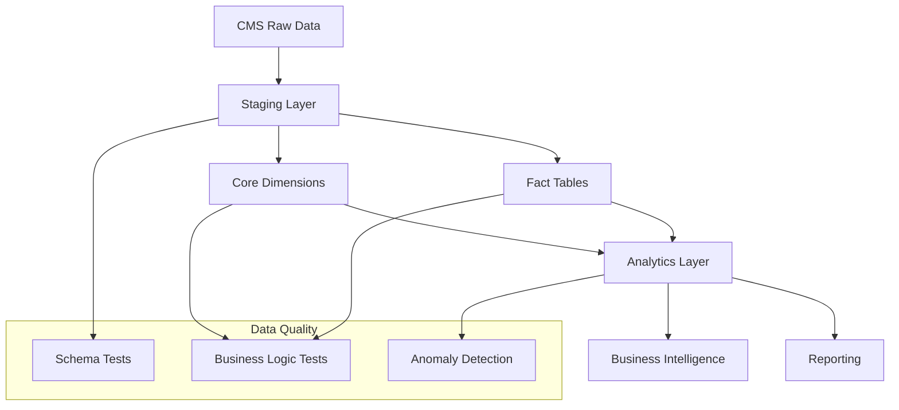

# Technical Documentation - Claims Data Warehouse

## Architecture Overview

### Data Flow Architecture



### Layer Responsibilities

#### Raw Data Layer
- **Purpose**: Store unprocessed CMS Medicare synthetic claims data
- **Format**: CSV files loaded into database tables
- **Retention**: Full historical data (2008-2010 for synthetic data)
- **Schema**: Mirrors CMS file specifications exactly

#### Staging Layer (`models/staging/`)
- **Purpose**: Clean, standardize, and enrich raw data
- **Transformations**:
  - Data type conversions
  - Null value handling
  - Business rule applications
  - Surrogate key generation
- **Materialization**: Views (for flexibility and freshness)
- **Tests**: Basic data quality and completeness

#### Core Layer (`models/marts/core/`)
- **Purpose**: Dimensional models optimized for analytics
- **Design Pattern**: Star schema with conformed dimensions
- **Materialization**: Tables (for performance)
- **SCD Implementation**: Type 1 (overwrite) for simplicity

#### Analytics Layer (`models/marts/analytics/`)
- **Purpose**: Pre-aggregated metrics and KPIs
- **Refresh**: Daily batch processing
- **Granularity**: Multiple time periods (daily, weekly, monthly)
- **Materialization**: Tables with strategic indexing

## Data Model Design

### Dimensional Modeling Principles

#### 1. Conformed Dimensions
All fact tables share the same dimension keys:
- `beneficiary_key` → Links to `dim_beneficiaries`
- `provider_key` → Links to `dim_providers`
- `date_key` → Links to `dim_date`

#### 2. Surrogate Keys
```sql
-- Example surrogate key generation
{{ dbt_utils.generate_surrogate_key(['business_key']) }} as surrogate_key
```

#### 3. Slowly Changing Dimensions
Current implementation uses **Type 1 SCD** (overwrite):
- Suitable for synthetic data and proof-of-concept
- Production would implement Type 2 for historical tracking

### Fact Table Design

#### Grain Definition
**`fact_claims`** grain: One row per individual claim submission

#### Measure Types
- **Additive**: `claim_amount`, `reimbursement_amount`
- **Semi-additive**: `processing_days` (averageable, not summable across time)
- **Non-additive**: `denial_rate` (requires recalculation)

#### Degenerate Dimensions
- `claim_id`: Stored directly in fact table
- `diagnosis_codes`: Multiple codes stored as separate columns

## Data Quality Framework

### Testing Hierarchy

#### Level 1: Schema Tests
```yaml
tests:
  - not_null
  - unique
  - relationships:
      to: ref('parent_table')
      field: parent_key
  - accepted_values:
      values: ['A', 'B', 'C']
```

#### Level 2: Business Logic Tests
```sql
-- Custom test example

    select *
    from {{ ref('fact_claims') }}
    where reimbursement_amount > claim_amount

```

#### Level 3: Statistical Tests
```sql
-- Anomaly detection using statistical methods
with stats as (
    select
        avg(daily_count) as mean_count,
        stddev(daily_count) as std_count
    from daily_aggregates
)
select *
from daily_aggregates
where daily_count > (mean_count + 2 * std_count)  -- 2-sigma threshold
```

### Data Quality Metrics

#### Completeness Score
```sql
select
    count(case when column_name is not null then 1 end)::decimal / count(*) as completeness_score
from table_name
```

#### Accuracy Score
```sql
select
    count(case when business_rule_check = true then 1 end)::decimal / count(*) as accuracy_score
from validation_results
```

#### Consistency Score
```sql
-- Cross-table consistency
select
    count(case when a.key = b.key then 1 end)::decimal / count(*) as consistency_score
from table_a a
left join table_b b on a.foreign_key = b.primary_key
```

## Performance Optimization

### Indexing Strategy

#### Fact Table Indexes
```sql
-- Primary key (clustered)
CREATE UNIQUE INDEX pk_fact_claims ON fact_claims (claim_key);

-- Foreign key indexes
CREATE INDEX idx_fact_claims_beneficiary ON fact_claims (beneficiary_key);
CREATE INDEX idx_fact_claims_provider ON fact_claims (provider_key);
CREATE INDEX idx_fact_claims_date ON fact_claims (claim_date_key);

-- Query-specific indexes
CREATE INDEX idx_fact_claims_amount ON fact_claims (claim_amount);
CREATE INDEX idx_fact_claims_status ON fact_claims (claim_status);
```

#### Dimension Table Indexes
```sql
-- Business key indexes (for joins from staging)
CREATE UNIQUE INDEX uk_dim_providers_business ON dim_providers (provider_id);
CREATE UNIQUE INDEX uk_dim_beneficiaries_business ON dim_beneficiaries (beneficiary_id);

-- Attribute indexes (for filtering)
CREATE INDEX idx_dim_providers_specialty ON dim_providers (specialty_description);
CREATE INDEX idx_dim_beneficiaries_age ON dim_beneficiaries (age_group);
```

### Partitioning Strategy

#### Time-based Partitioning
```sql
-- Partition fact tables by month for better performance
CREATE TABLE fact_claims (
    -- columns
) PARTITION BY RANGE (claim_start_date);

CREATE TABLE fact_claims_202301 PARTITION OF fact_claims
    FOR VALUES FROM ('2023-01-01') TO ('2023-02-01');
```

### Materialization Strategy

| Model Type | Materialization | Rationale |
|------------|-----------------|-----------|
| Staging | View | Flexibility, always fresh data |
| Dimensions | Table | Performance, relatively static |
| Facts | Table | Performance, large datasets |
| Analytics | Table | Performance, pre-aggregated |

### Query Optimization Patterns

#### Star Schema Joins
```sql
-- Optimized star schema query pattern
select
    d.specialty_description,
    sum(f.claim_amount) as total_claims
from fact_claims f
join dim_providers p on f.provider_key = p.provider_key
join dim_date d on f.claim_date_key = d.date_key
where d.year = 2009
  and p.state_code = 'CA'
group by d.specialty_description
```

#### Incremental Processing
```sql
-- Incremental model configuration
{{ config(
    materialized='incremental',
    unique_key='claim_key',
    on_schema_change='append_new_columns'
) }}

select * from {{ ref('staging_claims') }}

    where loaded_at > (select max(loaded_at) from {{ this }})

```

## Security & Compliance

### Data Privacy
- **De-identification**: All data uses synthetic identifiers
- **PII Handling**: No actual patient information in dataset
- **Access Controls**: Role-based access to different schema layers

### HIPAA Considerations (Production)
- **Encryption**: At-rest and in-transit
- **Audit Logging**: All data access logged
- **Access Reviews**: Regular access certification
- **Data Retention**: Automated purging policies

### Data Governance

#### Data Lineage
```yaml
# Automated lineage tracking through dbt
sources:
  - name: cms_raw
    description: "Source CMS files"

models:
  - name: stg_claims
    description: "Cleaned claims"

exposures:
  - name: provider_dashboard
    depends_on:
      - ref('metrics_provider_performance')
```

#### Data Catalog
- **Automated**: Generated from dbt documentation
- **Business Glossary**: Consistent definitions across organization
- **Impact Analysis**: Upstream/downstream dependencies

## Monitoring & Alerting

### dbt Test Monitoring
```yaml
# Alert configuration
on-run-end:
  - "{{ alert_on_test_failure() }}"

# Custom alert macro

  
    
    
      -- Send alert to monitoring system
      {{ log("ALERT: " ~ test_failures|length ~ " tests failed", info=true) }}
    
  

```

### Data Quality Dashboards
- **Real-time**: Test results and data freshness
- **Historical**: Quality trends over time
- **Alerting**: Threshold-based notifications

### Performance Monitoring
```sql
-- Query performance tracking
create table dbt_performance_log (
    model_name varchar(255),
    run_started_at timestamp,
    run_completed_at timestamp,
    duration_seconds integer,
    rows_affected integer
);
```

## Deployment Strategy

### Environment Management
```yaml
# profiles.yml structure
claims_data_warehouse:
  outputs:
    dev:
      type: postgres
      schema: analytics_dev
      threads: 4
    staging:
      type: postgres
      schema: analytics_staging
      threads: 6
    prod:
      type: postgres
      schema: analytics_prod
      threads: 8
  target: dev
```

### CI/CD Pipeline
```yaml
# .github/workflows/dbt.yml
name: dbt-ci
on: [push, pull_request]

jobs:
  test:
    runs-on: ubuntu-latest
    steps:
      - uses: actions/checkout@v2
      - name: Setup Python
        uses: actions/setup-python@v2
        with:
          python-version: 3.9
      - name: Install dependencies
        run: |
          pip install dbt-postgres
          dbt deps
      - name: Run dbt tests
        run: dbt test
```

### Blue-Green Deployment
```sql
-- Schema swapping for zero-downtime deployments
CREATE SCHEMA analytics_blue;
CREATE SCHEMA analytics_green;

-- Deploy to blue, then swap
ALTER SCHEMA analytics_prod RENAME TO analytics_old;
ALTER SCHEMA analytics_blue RENAME TO analytics_prod;
```

## Scalability Considerations

### Data Volume Growth
- **Current**: ~500k claims (synthetic data)
- **Production Scale**: 10M+ claims annually
- **Scaling Strategy**: Partitioning + incremental processing

### Processing Optimization
```yaml
# dbt resource allocation
models:
  claims_data_warehouse:
    staging:
      +pre-hook: "set work_mem = '256MB'"
      +post-hook: "analyze {{ this }}"
    marts:
      +pre-hook: "set work_mem = '512MB'"
```

### Infrastructure Scaling
- **Vertical**: Increase CPU/memory for compute-intensive models
- **Horizontal**: Parallel processing with dbt threads
- **Storage**: Automated archiving of historical data

## Troubleshooting Guide

### Common Issues

#### 1. Test Failures
```bash
# Investigate test failure
dbt test --select failing_model
dbt run-operation test_claim_amount_consistency
```

#### 2. Performance Issues
```sql
-- Query plan analysis
EXPLAIN ANALYZE SELECT * FROM fact_claims WHERE claim_date_key = 20090101;

-- Index usage verification
SELECT schemaname, tablename, indexname, idx_scan, idx_tup_read
FROM pg_stat_user_indexes
WHERE schemaname = 'analytics_prod';
```

#### 3. Data Quality Issues
```sql
-- Data profiling query
SELECT
    column_name,
    count(*) as total_rows,
    count(column_name) as non_null_rows,
    count(distinct column_name) as distinct_values,
    min(column_name) as min_value,
    max(column_name) as max_value
FROM information_schema.columns
WHERE table_schema = 'analytics_prod';
```

### Recovery Procedures
1. **Model Failure**: Re-run specific model with `dbt run --select model_name`
2. **Test Failure**: Investigate root cause, fix data or adjust test
3. **Performance Degradation**: Check query plans, update statistics, rebuild indexes

This technical documentation provides the foundation for maintaining and extending the Claims Data Warehouse platform.